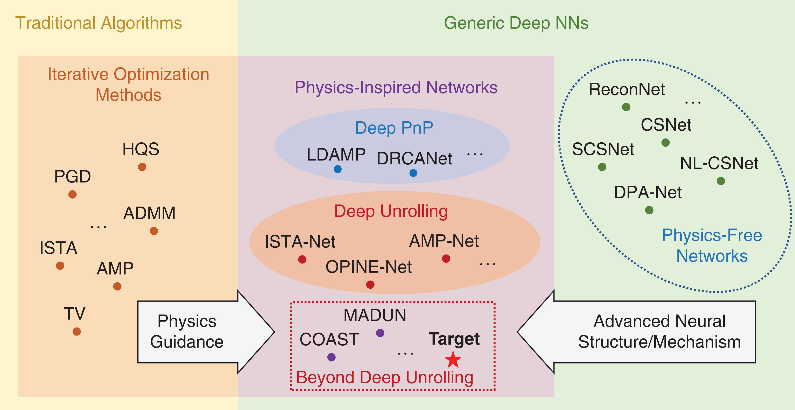

# Interpretable Networks

    
  (From Physics-Inspired Compressive Sensing: Beyond Deep Unrolling)
   

I am currently working on interpretable neural networks with wide applications in signal and image processing.
- [Surveys](#Surveys)
- [Deep PnP](#Deep_PnP)
- [Deep Unfolding](#Deep_Unfolding)
- [Applications](#Applications)
- [Links](#Links)

  
<strong> Last Update: 2023/11/20 </strong>

<a name="Surveys" />

### Surveys
- [2023] Physics-Inspired Compressive Sensing: Beyond Deep Unrolling, IEEE SPM  [[Paper](https://ieeexplore.ieee.org/abstract/document/10004834)]
- [2023] Learned Reconstruction Methods With Convergence Guarantees: A Survey of Concepts and Applications, IEEE SPM  [[Paper](https://ieeexplore.ieee.org/abstract/document/10004773)]
- [2023] Plug-and-Play Methods for Integrating Physical and Learned Models in Computational Imaging: Theory, Algorithms, and Applications, IEEE SPM [[Paper](https://ieeexplore.ieee.org/abstract/document/10004791)]
- [2023] Data-Driven Single Image Deraining: A Comprehensive Review and New Perspectives, Pattern Recognition [[Paper](https://www.sciencedirect.com/science/article/abs/pii/S0031320323004387)]
- [2023] Image Denoising: The Deep Learning Revolution and Beyond- A Survey Paper, SIAM Journal on Imaging Sciences [[Paper](https://epubs.siam.org/doi/abs/10.1137/23M1545859)]
- [2023] Model-Based Deep Learning, Foundations and Trends in Signal Processing [[Paper](https://www.nowpublishers.com/article/Details/SIG-113)] [[Python](https://github.com/ShlezingerLab/MBDL_Book)]
- [2023] Signal Decomposition Using Masked Proximal Operators, Foundations and Trends in Signal Processing [[Paper](https://www.nowpublishers.com/article/Details/SIG-122)]
- [2023] Solving Inverse Problems With Deep Neural Networks – Robustness Included? IEEE TPAMI [[Paper](https://ieeexplore.ieee.org/abstract/document/9705105)]
- [2022] Foundations of Computational Imaging: A Model-Based Approach, SIAM Press [[Book](https://epubs.siam.org/doi/book/10.1137/1.9781611977134)]
- [2022] Learning to Optimize: A Primer and A Benchmark, Journal of Machine Learning Research [[Paper](https://dl.acm.org/doi/abs/10.5555/3586589.3586778)] [[Python](https://github.com/VITA-Group/Open-L2O)]
- [2021] Algorithm Unrolling: Interpretable, Efficient Deep Learning for Signal and Image Processing, IEEE SPM  [[Paper](https://ieeexplore.ieee.org/abstract/document/9363511)]
- [2021] Deep Learning for Image Super-Resolution: A Survey, IEEE TPAMI  [[Paper](https://ieeexplore.ieee.org/abstract/document/9044873)]
- [2021] Model-based Reconstruction with Learning: From Unsupervised to Supervised and Beyond, arXiv  [[Paper](https://arxiv.org/abs/2103.14528)]
- [2020] Plug-and-Play Methods for Magnetic Resonance Imaging: Using Denoisers for Image Recovery, IEEE SPM  [[Paper](https://ieeexplore.ieee.org/abstract/document/8962388)]
- [2020] Deep Unfolding for Communications Systems: A Survey and Some New Directions, IEEE SiPS [[Paper](https://ieeexplore.ieee.org/abstract/document/9020494)]
- [2020] Image Reconstruction: From Sparsity to Data-Adaptive Methods and Machine Learning, P IEEE [[Paper](https://ieeexplore.ieee.org/abstract/document/8844696)]
- [2018] Using Deep Neural Networks for Inverse Problems in Imaging: Beyond Analytical Methods, IEEE SPM  [[Paper](https://ieeexplore.ieee.org/abstract/document/8253590)]
- [2016] Deep Learning, MIT Press  [[Book](https://www.deeplearningbook.org/)]
- [2014] Understanding Machine Learning: From Theory to Algorithms, Cambridge University Press [[Book](https://www.cs.huji.ac.il/~shais/UnderstandingMachineLearning/understanding-machine-learning-theory-algorithms.pdf)]

<a name="Deep_PnP" />

## Deep PnP
- [2023] PnP-ReG: Learned Regularizing Gradient for Plug-and-Play Gradient Descent, SIAM Journal on Imaging Sciences [[Paper](https://epubs.siam.org/doi/abs/10.1137/22M1490843)] 
- [2023] Preconditioned Plug-and-Play ADMM with Locally Adjustable Denoiser for Image Restoration, SIAM Journal on Imaging Sciences [[Paper](https://epubs.siam.org/doi/abs/10.1137/22M1504809)] [[Python](https://github.com/LEPENDUM/pnp)] 
- [2022] Proximal Denoiser for Convergent Plug-and-Play Optimization with Nonconvex Regularization, ICML [[Paper](https://proceedings.mlr.press/v162/hurault22a.html)] [[Python](https://github.com/samuro95/Prox-PnP)] 
- [2022] Truncated Residual Based Plug-and-Play ADMM Algorithm for MRI Reconstruction, IEEE TCI  [[Paper](https://ieeexplore.ieee.org/abstract/document/9693216)] [[Python](https://github.com/Houruizhi/TRPA)] 
- [2022] Tuning-Free Plug-and-Play Proximal Algorithm for Inverse Imaging Problems, Journal of Machine Learning Research [[Paper](https://jmlr.org/papers/v23/20-1297.html)] [[Python](https://github.com/Vandermode/TFPnP)]
- [2021] Deep-Learned Regularization and Proximal Operator for Image Compressive Sensing, IEEE TIP  [[Paper](https://ieeexplore.ieee.org/abstract/document/9459457)] [[Matlab](https://github.com/zjut-gwl/CSDRCANet)]
- [2021] On Plug-and-Play Regularization Using Linear Denoisers, IEEE TIP  [[Paper](https://ieeexplore.ieee.org/document/9418516)] [[Matlab](https://github.com/rgavaska/Convergent-PnP)]
- [2021] Scalable Plug-and-Play ADMM With Convergence Guarantees, IEEE TCI  [[Paper](https://ieeexplore.ieee.org/abstract/document/9473005)] [[Matlab](https://github.com/rgavaska/Convergent-PnP)]
- [2021] Plug-and-Play Image Restoration with Deep Denoiser Prior, IEEE TAMI  [[Paper](https://ieeexplore.ieee.org/abstract/document/7744574)] [[Python](https://github.com/cszn/DPIR)]
- [2021] Recovery Analysis for Plug-and-Play Priors using the Restricted Eigenvalue Condition, NIPS  [[Paper](https://proceedings.neurips.cc/paper_files/paper/2021/hash/2ea1202aed1e0ce30d41be4919b0cc99-Abstract.html)]
- [2020] Distributed Iterative CT Reconstruction Using Multi-Agent Consensus Equilibrium, IEEE TCI  [[Paper](https://ieeexplore.ieee.org/abstract/document/9143147)] 
- [2020] SIMBA: Scalable Inversion in Optical Tomography Using Deep Denoising Priors, IEEE JSTSP  [[Paper](https://ieeexplore.ieee.org/abstract/document/9107406)] 
- [2020] Plug-and-Play Algorithms for Large-Scale Snapshot Compressive Imaging, CVPR [[Paper](https://ieeexplore.ieee.org/document/9156491)] [[Matlab](https://github.com/liuyang12/PnP-SCI)]
- [2019] Regularization by Denoising: Clarifications and New Interpretations, IEEE TCI  [[Paper](https://ieeexplore.ieee.org/abstract/document/8528509)] [[Matlab](https://github.com/edward-reehorst/On_RED)]
- [2019] Block Coordinate Regularization by Denoising, NIPS  [[Paper](https://proceedings.neurips.cc/paper/2019/hash/9872ed9fc22fc182d371c3e9ed316094-Abstract.html)] 
- [2019] An Online Plug-and-Play Algorithm for Regularized Image Reconstruction, IEEE TCI  [[Paper](https://ieeexplore.ieee.org/abstract/document/8616843)] [[Matlab](https://github.com/sunyumark/2019-TCI-OnlinePnP)]
- [2019] Plug-and-Play Methods Provably Converge with Properly Trained Denoisers, ICML [[Paper](https://proceedings.mlr.press/v97/ryu19a.html)] [[Python](https://github.com/uclaopt/Provable_Plug_and_Play)]
- [2019] MoDL: Model-Based Deep Learning Architecture for Inverse Problems, IEEE TMI [[Paper](https://ieeexplore.ieee.org/abstract/document/8434321)] 
- [2018] Plug-and-Play Unplugged: Optimization-Free Reconstruction Using Consensus Equilibrium, SIAM Journal on Imaging Sciences  [[Paper](https://epubs.siam.org/doi/abs/10.1137/17M1122451)]  [[Python](https://github.com/gbuzzard/PnP-MACE)]
- [2017] The Little Engine That Could: Regularization by Denoising (RED), SIAM Journal on Imaging Sciences  [[Paper](https://epubs.siam.org/doi/abs/10.1137/16M1102884)]  [[Matlab](https://github.com/google/RED)]
- [2017] Plug-and-Play ADMM for Image Restoration: Fixed-Point Convergence and Applications, IEEE TCI  [[Paper](https://ieeexplore.ieee.org/abstract/document/7744574)] [[Matlab](https://www.mathworks.com/matlabcentral/fileexchange/60641-plug-and-play-admm-for-image-restoration)]
- [2017] Learning Proximal Operators: Using Denoising Networks for Regularizing Inverse Imaging Problems, ICCV  [[Paper](https://openaccess.thecvf.com/content_iccv_2017/html/Meinhardt_Learning_Proximal_Operators_ICCV_2017_paper.html)]  [[Python](https://github.com/tum-vision/learn_prox_ops)]
- [2017] Primal-Dual Plug-and-Play Image Restoration, IEEE SPL  [[Paper](https://ieeexplore.ieee.org/abstract/document/7936537)]
- [2017] A Plug-and-Play Priors Approach for Solving Nonlinear Imaging Inverse Problems, IEEE SPL  [[Paper](https://ieeexplore.ieee.org/abstract/document/8068267)]
- [2013] Plug-and-Play Priors for Model Based Reconstruction, IEEE GlobalSIP  [[Paper](https://ieeexplore.ieee.org/abstract/document/6737048)]  [[Matlab](https://github.com/svvenkatakrishnan/plug-and-play-priors)]

<a name="Deep_Unfolding" />

## Deep Unfolding
- [2023] Deep Equilibrium Models for Snapshot Compressive Imaging, AAAI [[Paper](https://ojs.aaai.org/index.php/AAAI/article/view/25475)]  [[Python](https://github.com/IndigoPurple/DEQSCI)]
- [2023] Online Deep Equilibrium Learning for Regularization by Denoising, NIPS [[Paper](https://proceedings.neurips.cc/paper_files/paper/2022/hash/a2440e23f6a8c037eff1dc4f1156aa35-Abstract-Conference.html)]
- [2022] Content-Aware Scalable Deep Compressed Sensing, IEEE TIP  [[Paper](https://ieeexplore.ieee.org/abstract/document/9854112)] [[Python](https://github.com/Guaishou74851/CASNet)]
- [2021] Memory-Augmented Deep Unfolding Network for Compressive Sensing, ACM MM  [[Paper](https://dl.acm.org/doi/abs/10.1145/3474085.3475562)] 
- [2021] ISTA-NET++: Flexible Deep Unfolding Network for Compressive Sensing, IEEE ICME  [[Paper](https://ieeexplore.ieee.org/abstract/document/9428249)]  [[Python](https://github.com/jianzhangcs/ISTA-Netpp)]
- [2021] COAST: COntrollable Arbitrary-Sampling NeTwork for Compressive Sensing, IEEE TIP  [[Paper](https://ieeexplore.ieee.org/abstract/document/9467810)]
- [2021] LoRD-Net: Unfolded Deep Detection Network With Low-Resolution Receivers, IEEE TSP  [[Paper](https://ieeexplore.ieee.org/abstract/document/9557819)]
- [2021] Deep K-SVD Denoising, IEEE TIP  [[Paper](https://ieeexplore.ieee.org/abstract/document/9464674)] [[Python](https://github.com/meyerscetbon/Deep-K-SVD)]
- [2021] Deep Equilibrium Architectures for Inverse Problems in Imaging, IEEE TCI  [[Paper](https://ieeexplore.ieee.org/abstract/document/9565378)] [[Python](https://github.com/dgilton/deep_equilibrium_inverse)]
- [2021] Multi-Channel Deep Networks for Block-Based Image Compressive Sensing, IEEE TMM  [[Paper](https://ieeexplore.ieee.org/abstract/document/9159912)] [[Python](https://github.com/siwangzhou/DeepBCS)]
- [2021] Iterative Algorithm Induced Deep-Unfolding Neural Networks: Precoding Design for Multiuser MIMO Systems, IEEE TWC  [[Paper](https://ieeexplore.ieee.org/abstract/document/9246287)]
- [2020] AMP-Net: Denoising-Based Deep Unfolding for Compressive Image Sensing, IEEE TIP  [[Paper](https://ieeexplore.ieee.org/abstract/document/9298950)]
- [2020] Optimization-Inspired Compact Deep Compressive Sensing, IEEE JSTSP [[Paper](https://ieeexplore.ieee.org/abstract/document/9019857)]
- [2020] iPiano-Net: Nonconvex optimization inspired multi-scale reconstruction network for compressed sensing, Signal Processing: Image Communication [[Paper](https://www.sciencedirect.com/science/article/abs/pii/S0923596520301521)]
- [2020] Unfolding the Alternating Optimization for Blind Super Resolution, NIPS  [[Paper](https://proceedings.neurips.cc/paper/2020/hash/3d2d8ccb37df977cb6d9da15b76c3f3a-Abstract.html)]
- [2020] Deep Unfolding Network for Image Super-Resolution, NIPS  [[Paper](https://openaccess.thecvf.com/content_CVPR_2020/html/Zhang_Deep_Unfolding_Network_for_Image_Super-Resolution_CVPR_2020_paper.html)]
- [2020] Efficient and Interpretable Deep Blind Image Deblurring Via Algorithm Unrolling, IEEE TCI  [[Paper](https://ieeexplore.ieee.org/abstract/document/8950351)]
- [2020] ADMM-CSNet: A Deep Learning Approach for Image Compressive Sensing, IEEE TPAMI [[Paper](https://ieeexplore.ieee.org/abstract/document/8550778)] [[Python](https://github.com/yangyan92/Pytorch_ADMM-CSNet)]
- [2020] Model-Driven Deep Learning for MIMO Detection, IEEE TSP  [[Paper](https://ieeexplore.ieee.org/abstract/document/9018199)] 
- [2020] Deep Unfolded Robust PCA With Application to Clutter Suppression in Ultrasound, IEEE TCI  [[Paper](https://ieeexplore.ieee.org/abstract/document/8836615)] [[Pyhton](https://github.com/KrakenLeaf/CORONA)]
- [2020] Efficient and Interpretable Deep Blind Image Deblurring Via Algorithm Unrolling, IEEE TCI  [[Paper](https://ieeexplore.ieee.org/abstract/document/8950351)]
- [2020] Invertible Image Rescaling, ECCV  [[Paper](https://link.springer.com/chapter/10.1007/978-3-030-58452-8_8)]
- [2020] On the Convergence of Learning-Based Iterative Methods for Nonconvex Inverse Problemss, IEEE TPAMI [[Paper](https://ieeexplore.ieee.org/abstract/document/8727950)] [[Matlab](https://github.com/Heyi007/FIMAt)]
- [2019] Deep Tensor ADMM-Net for Snapshot Compressive Imaging, ICCV [[Paper](https://openaccess.thecvf.com/content_ICCV_2019/html/Ma_Deep_Tensor_ADMM-Net_for_Snapshot_Compressive_Imaging_ICCV_2019_paper.html)]
- [2019] Learning a Compressed Sensing Measurement Matrix via Gradient Unrolling, ICML [[Paper](https://proceedings.mlr.press/v97/wu19b.html)]
- [2019] Learning to Detect, IEEE TSP [[Paper](https://ieeexplore.ieee.org/abstract/document/8642915)] 
- [2018] ISTA-Net: Interpretable Optimization-Inspired Deep Network for Image Compressive Sensing, CVPR [[Paper](https://openaccess.thecvf.com/content_cvpr_2018/html/Zhang_ISTA-Net_Interpretable_Optimization-Inspired_CVPR_2018_paper.html)] [[Python](https://github.com/jianzhangcs/ISTA-Net-PyTorch)]
- [2018] Theoretical Linear Convergence of Unfolded ISTA and Its Practical Weights and Thresholds, NIPS [[Paper](https://proceedings.neurips.cc/paper/2018/hash/cf8c9be2a4508a24ae92c9d3d379131d-Abstract.html)] [[Python](https://github.com/xchen-tamu/linear-lista-cpss)]
- [2017] Compressed Sensing using Generative Models, ICML  [[Paper](http://proceedings.mlr.press/v70/bora17a.html)]
- [2017] Learned D-AMP: Principled Neural Network based Compressive Image Recovery, NIPS [[Paper](https://proceedings.neurips.cc/paper/2017/hash/8597a6cfa74defcbde3047c891d78f90-Abstract.html)]
- [2016] From Denoising to Compressed Sensing, IEEE TIT  [[Paper](https://ieeexplore.ieee.org/abstract/document/7457256)]  [[Matlab](https://github.com/ricedsp/D-AMP_Toolbox)]
- [2016] Learning to Deblur, IEEE TPAMI  [[Paper](https://ieeexplore.ieee.org/abstract/document/7274732)] 
- [2016] Learning to Learn by Gradient Descent by Gradient Descent, NIPS [[Paper](https://proceedings.neurips.cc/paper_files/paper/2016/hash/fb87582825f9d28a8d42c5e5e5e8b23d-Abstract.html)] [[Python](https://github.com/chenwydj/learning-to-learn-by-gradient-descent-by-gradient-descent)]
- [2015] Learning Efficient Sparse and Low Rank Models, IEEE TPAMI [[Paper](https://ieeexplore.ieee.org/abstract/document/7010964)]
- [2010] Learning Fast Approximations of Sparse Coding, ICML [[Paper](https://dl.acm.org/doi/abs/10.5555/3104322.3104374)] [[Matlab](https://github.com/minhnhat93/lfa_sc)]

<a name="Applications" />

## Applications

### Image Denoising
- [2023] Tuning-free Plug-and-Play Hyperspectral Image Deconvolution with Deep Priors, IEEE TGRS [[Paper](https://ieeexplore.ieee.org/abstract/document/10061448)] [[Python](https://github.com/xiuheng-wang/Tuning_free_PnP_HSI_deconvolution)]
- [2022] Learning Deep Sparse Regularizers With Applications to Multi-View Clustering and Semi-Supervised Classification, IEEE TPAMI [[Paper](https://ieeexplore.ieee.org/document/9439159)]  [[Python](https://github.com/chenzl23/DSRL)]
- [2020] ADMM-CSNet: A Deep Learning Approach for Image Compressive Sensing, IEEE TPAMI [[Paper](https://ieeexplore.ieee.org/abstract/document/8550778)] [[Python](https://github.com/yangyan92/Pytorch_ADMM-CSNet)]
- [2019] Image Compressed Sensing Using Convolutional Neural Network, IEEE TIP  [[Paper](https://ieeexplore.ieee.org/abstract/document/8765626)]
- [2018] FFDNet: Toward a Fast and Flexible Solution for CNN-Based Image Denoising, IEEE TIP [[Paper](https://ieeexplore.ieee.org/abstract/document/8365806)] [[Matlab](https://github.com/cszn/FFDNet)]
- [2017] Deep Convolutional Neural Network for Inverse Problems in Imaging, IEEE TIP  [[Paper](https://ieeexplore.ieee.org/abstract/document/7949028)] [[Matlab](https://github.com/panakino/FBPConvNet)]
- [2017] Compressed Sensing Using Generative Models, ICML [[Paper](http://proceedings.mlr.press/v70/bora17a.html)]
- [2016] ReconNet: Non-Iterative Reconstruction of Images From Compressively Sensed Measurements, CVPR [[Paper](https://openaccess.thecvf.com/content_cvpr_2016/html/Kulkarni_ReconNet_Non-Iterative_Reconstruction_CVPR_2016_paper.html)] 
- [2016] A deep learning approach to structured signal recovery, IEEE ALLERTON  [[Paper](https://ieeexplore.ieee.org/abstract/document/7447163)] 

### Fault Diagnosis
- [2023] 可解释机械智能诊断技术的研究进展与挑战, 机械工程学报 [[Paper](http://www.cjmenet.com.cn/CN/abstract/abstract26822.shtml)]
- [2023] Adversarial Algorithm Unrolling Network for Interpretable Mechanical Anomaly Detection, IEEE TNNLS  [[Paper](https://ieeexplore.ieee.org/abstract/document/10070389)]
- [2023] Adversarial Algorithm Unrolling Network for Interpretable Mechanical Anomaly Detection, IEEE JSEN  [[Paper](https://ieeexplore.ieee.org/abstract/document/10323305)]
- [2022] Interpretable Neural Network via Algorithm Unrolling for Mechanical Fault Diagnosis, IEEE TIM  [[Paper](https://ieeexplore.ieee.org/abstract/document/9817047)]
- [2022] Model-driven deep unrolling: Towards interpretable deep learning against noise attacks for intelligent fault diagnosis, ISA Transactions  [[Paper](https://www.sciencedirect.com/science/article/abs/pii/S0019057822000878)]

<a name="Links" />

## Links
### Journals
- IEEE Transactions on Image Processing [[Link](https://ieeexplore.ieee.org/xpl/RecentIssue.jsp?punumber=83)]
- IEEE Transactions on Computational Imaging [[Link](https://ieeexplore.ieee.org/xpl/RecentIssue.jsp?punumber=6745852)]
- SIAM Journal on Imaging Sciences [[Link](https://epubs.siam.org/journal/sjisbi)]

### Tools
- SPORCO: Sparse Optimization Research Code  [[Link](https://github.com/bwohlberg/sporco)]
- SCICO: Scientific Computational Imaging Code  [[Link](https://github.com/lanl/scico)]
- LibADMM: A Library of ADMM for Sparse and Low-rank Optimization [[Link](https://github.com/canyilu/LibADMM-toolbox)]
